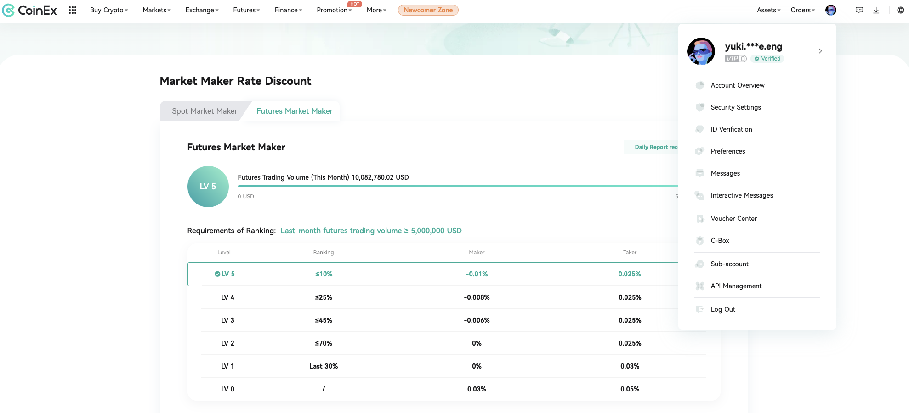

# lapuacore

Exchange-agnostic low-latency trading system core library (Go)

[Japanese](README.ja.md)

## Background

**lapuacore** inherits the architecture and design philosophy of **lapua**, a private HFT library developed and operated by the author, and restructures it for public release.
The author, as an independent individual trader, served as an **official market maker on CoinEx** using lapua, **providing approximately $10M/month in liquidity** at peak.



lapuacore provides domain models, gateway abstractions, and concurrency primitives, with exchange adapters implemented for CoinEx and Bybit.


> **Note:** This project is a design reference, not an actively maintained OSS library.

## Design Highlights

### Exchange-Agnostic Domain Layer

Each exchange differs in WebSocket frame format, order lifecycle semantics, and rate-limit rules. lapuacore absorbs these differences through a Gateway interface, allowing domain logic to operate solely against the abstraction. Adding or swapping exchange adapters has zero impact on domain code. Market data from multiple exchanges can be handled uniformly, enabling cross-exchange strategy development.

### Asynchronous Order Execution

Treating the exchange as the source of truth introduces round-trip latency on every state check. lapuacore manages order state transitions through an internal state machine and reconciles asynchronous events (fills, cancels, expiries) internally.

```
Market:  Born → Sending → Done

Limit:   Born → Sending → Pending ⇄ Amending
                              │
                              ├→ Done
                              │      ↑
                          Canceling ─┘
```

For limit orders, Amend / Cancel requests issued during Sending / Amending are automatically executed upon completion of the preceding operation. Multiple Amend requests retain only the last one, and Cancel overwrites any existing Amend.

### B-Tree Order Book

The order book (OrderBook) uses `google/btree` for price level management.

- **Best bid/ask retrieval**: O(1) -- cached
- **Price-ordered iteration**: O(n) -- leverages B-Tree structural ordering, no sorting required
- **Cumulative volume / average execution price**: computed by forward traversal of the B-Tree

### Event-Driven Callback Design

Callbacks can be registered for market data and order lifecycle events. The strategy layer can react immediately to state changes without polling.

**Market State Changes**
- Order book updates
- Best price (Quote) updates
- Exchange trade data (Trade)

**Order Lifecycle**
- Order accepted (Sending -> Pending)
- Amendment completed (Amending -> Pending)
- Cancellation completed (Canceling -> Done)
- Filled (-> Done)
- Partially filled
- Order reject, amendment reject, cancellation reject

### Redundant WebSocket for High Availability

lapuacore manages N redundant WebSocket connections via ChannelGroup, subscribing to the same topics in parallel. A TTL cache eliminates duplicate messages, processing only the first data to arrive. This prevents market data gaps from single connection drops and reduces average message delivery time.

### Other Design Decisions

**Exchange Connectivity**

- **Rate limit management**: Rate limiters are implemented per quota group (Order, Cancel, etc.) based on each exchange's official documentation. Quota is checked before dispatch, proactively avoiding 429 errors.
- **Persistent TLS connections**: TLS connections to exchange REST APIs are kept alive, eliminating per-order TLS handshake overhead.
- **WebSocket health checks**: Each WebSocket connection runs a 3-second ping/pong liveness check with automatic reconnection on timeout. Each leg of the redundant WebSocket group operates independently.

**Concurrency Control**

- **Two-tier order locking**: `Order` holds a state-protecting RWMutex (`mu`) and an operation-exclusive Mutex (`muOpe`). State reads are never blocked by in-flight operations.
- **Atomic multi-order locking**: `WithOpeLocks(orders, f)` acquires operation locks on multiple orders at once, preventing races such as an individual Amend interleaving with a batch Cancel.
- **Generic thread-safe primitives**: `mutex.Flag` / `mutex.Map` / `mutex.Slice` are provided as generics, offering type-safe operations, max-length enforcement, and concurrent iteration — capabilities absent from the standard `sync.Map`.

**Order Management**

- **Immediate tracking via internal ID**: Orders maintain both an internally generated ID (xid) and the exchange-assigned Public ID. This allows tracking by internal ID before the Public ID is confirmed, decoupling callback binding from exchange response timing.
- **Unrelated order tracking**: Orders from manual trading or other bots are tracked as `UnrelatedOrders`, separated from strategy-managed orders. This cleanly isolates position calculations and cancel targets when sharing an account across multiple strategies or manual operations.

**Configuration**

- **Config hot reload**: File changes are detected via fsnotify, allowing parameter updates without application restart.
- **Fail-safe**: On config parse failure, the last cached value is returned and operation continues, with failed keys reported via periodic logging. If the fsnotify watcher itself breaks, the application is gracefully shut down via `CancelCauseFunc`, eliminating the risk of running with stale configuration.

## Architecture

```
Strategy Layer (user-provided)
        |
        v
+---------------------------------------------+
|              lapuacore                       |
|                                              |
|  domains/                                    |
|    +-- deals/     Order state machine,       |
|    |              Dealer, Agent               |
|    +-- insights/  OrderBook, Quote,          |
|                   Trade, PriceLevel          |
|                                              |
|  initializers/                               |
|    +-- lapua/     Startup orchestration      |
|    +-- exchanges/ Per-exchange init          |
|       +-- coinex/                            |
|       +-- bybit/                             |
|                                              |
|  configs/    YAML config + hot reload        |
|  metrics/    InfluxDB + latency              |
|  mutex/      Thread-safe primitives          |
+----------------------------------------------+
|  internal/gateways/exchanges/                |
|    +-- coinex/  REST + WebSocket             |
|    +-- bybit/   REST + WebSocket             |
+----------------------------------------------+
        |
        v
   Exchange APIs (WebSocket / REST)
```

## Project Structure

| Package | Role |
|---|---|
| `domains/deals` | Order state machine, Dealer (per-symbol singleton order manager), Agent interface |
| `domains/insights` | OrderBook (B-Tree order book), Quote (best bid/ask), Trade (execution data stream) |
| `initializers/` | Startup orchestration. `lapua/` for overall init, `exchanges/` for per-exchange init |
| `configs/` | YAML config/secret loading, fsnotify hot reload |
| `metrics/` | InfluxDB exporter, WebSocket latency and custom metric measurement |
| `internal/gateways/` | Exchange adapter implementation. REST API (HMAC signing, rate limiter), WebSocket (channels, topics, auth, health check) |
| `mutex/` | Generic thread-safe types (Flag, Map, Slice) |

## Supported Exchanges

| Exchange | Product | Symbols |
|---|---|---|
| CoinEx | Futures | BTCUSDT, ETHUSDT, SOLUSDT, XRPUSDT |
| Bybit | Linear | BTCUSDT, ETHUSDT, SOLUSDT, XRPUSDT |

## Dependencies

| Library | Purpose |
|---|---|
| `google/btree` | B-Tree price level management for order book |
| `gorilla/websocket` | WebSocket stream handling |
| `shopspring/decimal` | Arbitrary-precision decimal arithmetic for price/quantity |
| `fsnotify/fsnotify` | Config file hot reload |
| `InfluxCommunity/influxdb3-go` | Metrics export |
| `hashicorp/go-retryablehttp` | HTTP client with retries |

## Documentation

- [Getting Started](docs/getting-started.md)
- [Getting Started (日本語)](docs/getting-started.ja.md)

## License

[Apache License 2.0](LICENSE)
